# **Advanced Lane Finding on the Road WRITEUP** 

## REFLECTION

This document is the reflection of the development of the pipeline to find lane lines in a real road, in this case, in the Highway 280 of California.


This document is divided in 3 sections: the first one, is the **pipeline** whit its corresponding experiments. The second one, is the **limitations** of the pipeline. And the last one is the possible **improvements** of the pipeline.

This is the advance version of the Finding Lane Lines on the Road project ([GitHub repository](https://github.com/rscova/CarND-LaneLines-P1))


The pipeline is based in 6 steps and 2 extras:
1. Compute the camera calibration matrix and distortion coefficients given a set of chessboard images.
2. Apply a distortion correction to raw images.
3. Use color transforms, gradients, etc., to create a thresholded binary image.
4. Apply a perspective transform to rectify binary image ("birds-eye view").
5. Detect lane pixels and fit to find the lane boundary.
6. Determine the curvature of the lane and vehicle position with respect to center.
7. Warp the detected lane boundaries back onto the original image
8. Output visual display of the lane boundaries and numerical estimation of lane curvature and vehicle position.


For full implementation details check [pipeline_step_by_step.ipynb](https://github.com/rscova/CarND-Advanced-Lane-Lines/blob/master/pipeline_step_by_step.ipynb)

## Advanced Lane Finding Step By Step

### Step 1: Camera Calibration
**1.1 Extract object points and image points for camera calibration**
I start by preparing "object points", which will be the (x, y, z) coordinates of the chessboard corners in the world. Here I am assuming the chessboard is fixed on the (x, y) plane at z=0, such that the object points are the same for each calibration image.  Thus, `objp` is just a replicated array of coordinates, and `objpoints` will be appended with a copy of it every time I successfully detect all chessboard corners in a test image.  `imgpoints` will be appended with the (x, y) pixel position of each of the corners in the image plane with each successful chessboard detection. 


**1.2 Calibrate and calculate distortion coefficients**
I then used the output `objpoints` and `imgpoints` to compute the camera calibration and distortion coefficients using the `cv2.calibrateCamera()` function.  I applied this distortion correction to the test image using the `cv2.undistort()` function and obtained this result:


### Step 2: Distortion correction
To demonstrate this step,I will describe how I apply the distortion correction to a real road scenario and see the differences between the original image and the undistorted image:

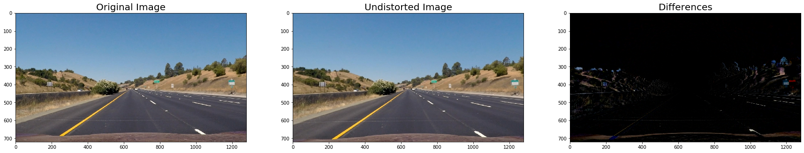


### Step 3: Color Spaces and Gradients

**3.1 Color Spaces: RGB, HSV and HLS**

The channel S(HLS) and R(RGB) darkened, are the most suitable channels to detect lines. I used `cv2.split` to get the channels. S detects a little bit better the yellow and white marks in different iluminations, but get less information than R dark. Despite, R dark don't take acount the shadows, but it is work worst than S (sometimes) because detects more light. Here there are the channels that it tried to increase the detection: 

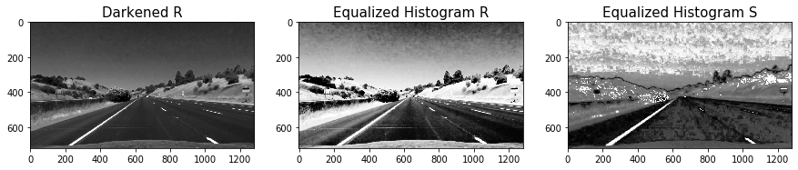


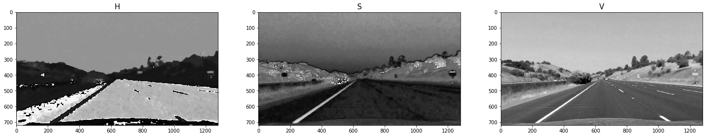

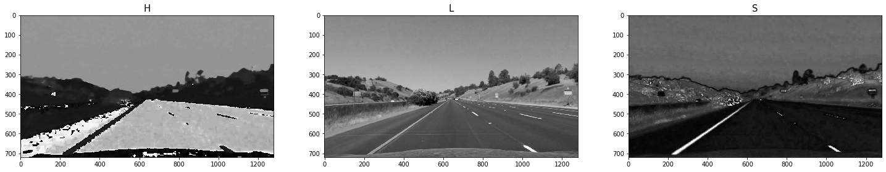

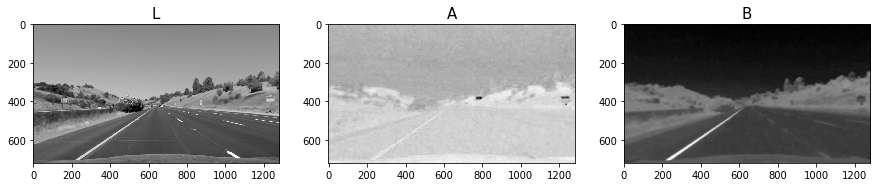

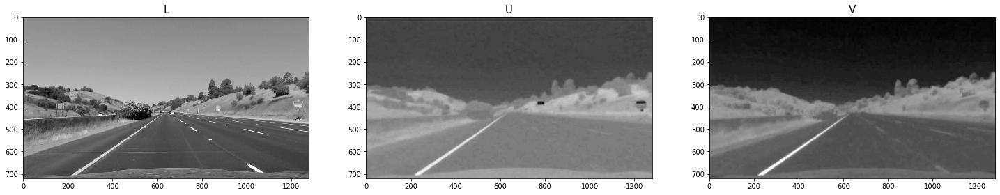

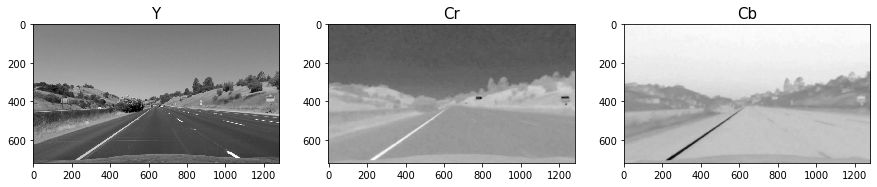


**3.2 Thresholds to Channels R(RGB),S(HLS)**
A simple binarization is enough for the R darked and S channels. But, for a better detection in different illumination conditions I have used the `cv2.THRESH_TRIANGLE` method using the function `cv2.threshold`. So, the best threshold that I found was 100:

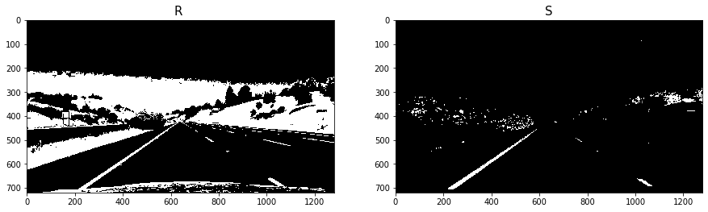


**3.3 Gradients**
As edge feature detector I have used `Sobel Operator` and Gradients.


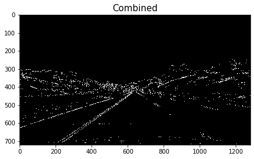


**3.4 Color and Gradient**
Finally, I used a combination of color and gradient thresholds to generate a binary image . Here's an example of my output for this step.

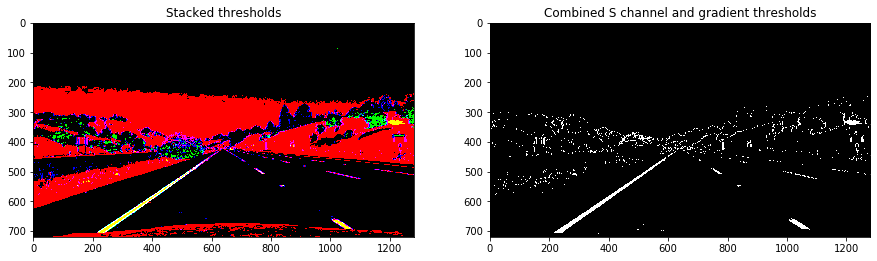


### Step 4: Perspective transform (Bird's Eye)
The code for my perspective transform includes a function called `warper()`.  The `warper()` function takes as inputs an image (`img`), as well as source (`src`) and destination (`dst`) points. Besides, using `morphologyEx` as OPEN and TOP-HAT it is posible eliminate some part of the binarization noise.

I chose the hardcode the source and destination points in the following manner:


```python
# define 4 source points
src = np.float32(
    [[(img_size[0] / 2) - 63, img_size[1] / 2 + 100],
    [((img_size[0] / 6) - 20), img_size[1]],
    [(img_size[0] * 5 / 6) + 60, img_size[1]],
    [(img_size[0] / 2) + 63, img_size[1] / 2 + 100]])
dst = np.float32(
    [[(img_size[0] / 4), 0],
    [(img_size[0] / 4), img_size[1]],
    [(img_size[0] * 3 / 4), img_size[1]],
    [(img_size[0] * 3 / 4), 0]])
```

This resulted in the following source and destination points:

| Source        | Destination   | 
|:-------------:|:-------------:| 
| 577, 460      | 320, 0        | 
| 193, 720      | 320, 720      |
| 1126, 720     | 960, 720      |
| 705, 460      | 960, 0        |


I verified that my perspective transform was working as expected by drawing the `src` and `dst` points onto a test image and its warped counterpart to verify that the lines appear parallel in the warped image.

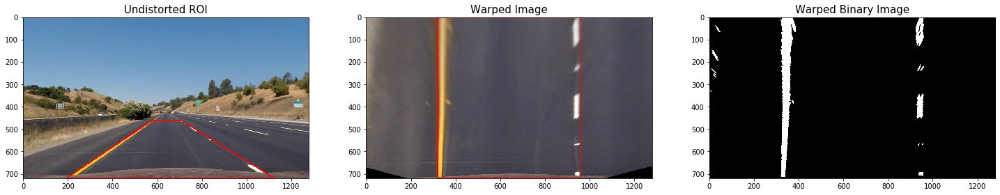


### Step 5: Detect lane lines

**5.1 Compute Histogram and Locate Lane Lines**

Take the bottom half of the image to compute the histogram, thus, the lane lines are more vertical.

Compute the histogram, the peaks will be regions with more probability to be a lane line.

Divide the histogram in to equal parts and get the maximum peak of each side. The peaks are the first position of the left and right lines.

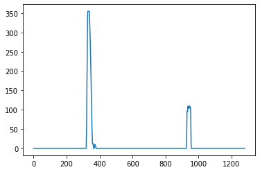


Updated version using bins to agroup cols of pixels


**5.2 Sliding Windows and Fit a Polynomial**

As shown in the previous animation, we can use the two highest peaks from our histogram as a starting point for determining where the lane lines are, and then use sliding windows moving upward in the image (further along the road) to determine where the lane lines go.

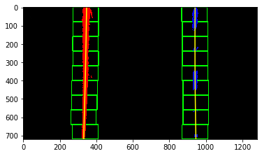


**5.3 Search from Prior**

Using the full algorithm from before and starting fresh on every frame may seem inefficient, as the lane lines don't necessarily move a lot from frame to frame.

In the next frame of video you don't need to do a blind search again, but instead you can just search in a margin around the previous lane line position, like in the above image. The green shaded area shows where we searched for the lines this time. So, once you know where the lines are in one frame of video, you can do a highly targeted search for them in the next frame.

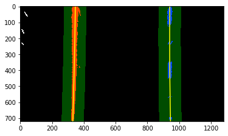


### Step 6: Determine the lane curvature

**6.1 Radius of Curvature**

The radius of curvature <A HREF="https://www.intmath.com/applications-differentiation/8-radius-curvature.php" target="_blank">(awesome tutorial)</A> at any point $x$ of the function $x = f(y)$, where $f(y)$ is a second order polynomial, is given as follows:

$$R_{curve} = \frac{(1+(2Ay+B)^{2})^{3/2}}{|2A|}$$

Where:

$$ f'(y) = \frac{dx}{dy} = 2Ay + B  $$
$$ f''(y) = \frac{d^2 x}{d^2 y} = 2A  $$


**6.2 From Pixels to Real-World**

We've calculated the radius of curvature based on pixel values, so the radius we are reporting is in pixel space, which is not the same as real world space. So we actually need to repeat this calculation after converting our x and y values to real world space.

This involves measuring how long and wide the section of lane is that we're projecting in our warped image. We could do this in detail by measuring out the physical lane in the field of view of the camera, but for this project, you can assume that if you're projecting a section of lane similar to the images above, the lane is about 30 meters long and 3.7 meters wide.

Let's say that the camera image has 720 relevant pixels in the y-dimension (remember, the image is perspective-transformed!), and we'll say roughly 700 relevant pixels in the x-dimension.

Once the parameters of the parabole ($x = ay^2 + by + c$) are calculated, this formula can convert the coeficients from pixels to meters:
$$ x = \frac {mx}{my^2} ay^2 + \frac{mx}{my}by + c$$


**6.3 Car lane center offset**
As the camera is mounted at the center of the car, such that the lane center is the midpoint at the bottom of the image between the two lines you've detected. The offset of the lane center from the center of the image (converted from pixels to meters) is your distance from the center of the lane. 


### Plot Everythig together


